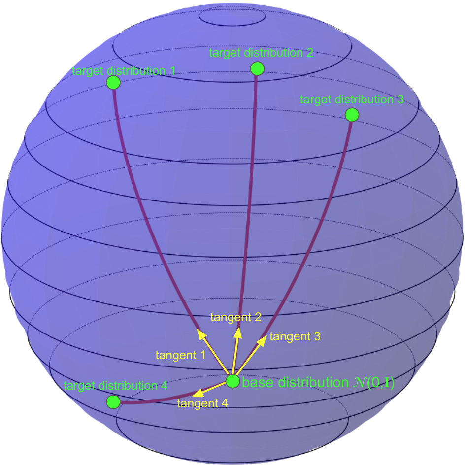
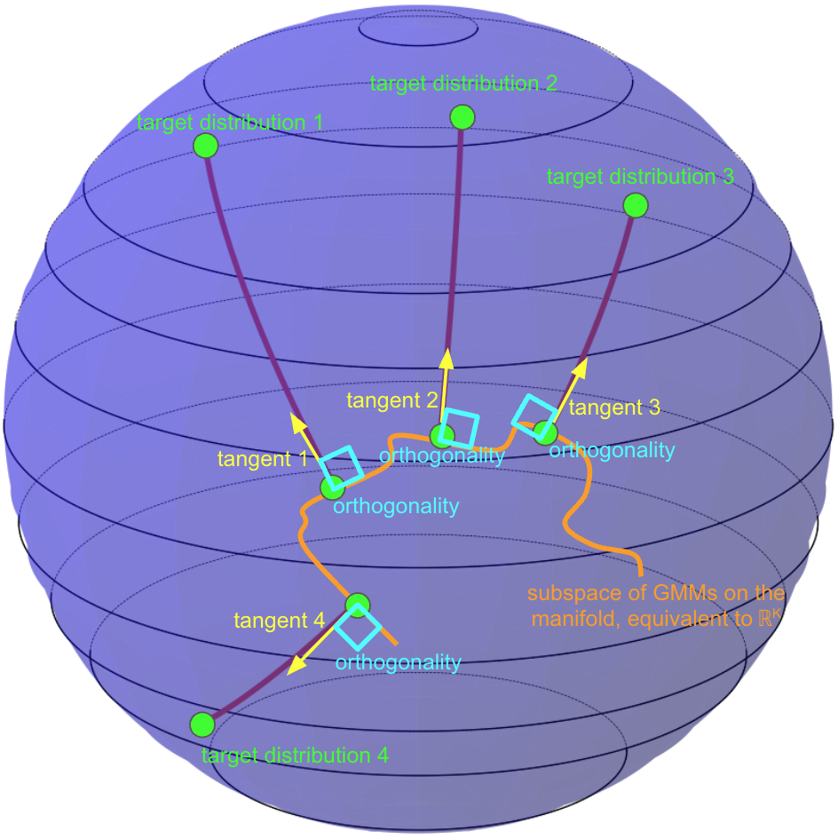

# MixFlow

Mixture-Conditioned Flow Matching for Out-of-Distribution Generalization.

[Home](index.md) | [Installation](installation.md) | [Running MixFlow](running.md)

---
<table>
<tr>
<td align="center">

 
<b>(A)</b> Vanilla CFM
</td>
<td align="center">

 
<b>(B)</b> MixFlow
</td>
</tr>
</table>

## Overview

MixFlow is a conditional flow-matching framework for descriptor-controlled generation. Instead of relying on a single Gaussian base distribution, MixFlow learns a mixture base and a descriptor-conditioned flow jointly, trained via shortest-path flow matching. This joint modeling is designed to extrapolate smoothly to unseen conditions and improve out-of-distribution generalization across tasks.

## Publication

This project is based on the **MixFlow** manuscript.

- **Title:** MixFlow: Mixture-Conditioned Flow Matching for Out-of-Distribution Generalization
- **Authors:** Andrea Rubbi, Amir Akbarnejad, Mohammad Vali Sanian, Aryan Yazdan Parast, Hesam Asadollahzadeh, Arian Amani, Naveed Akhtar, Sarah Cooper, Andrew Bassett, Lassi Paavolainen, Pietro Liò, Sattar Vakili, Mo Lotfollahi
- **Link:** _TODO_

## Datasets

### Synthetic Data

We construct a synthetic benchmark of letter populations, where each condition corresponds to a letter and a specific rotation. Each descriptor encodes the letter identity and rotation, and MixFlow learns a mixture base distribution per condition. This setup allows us to test extrapolation to unseen letters and rotation angles.

### Morphological Perturbations

We evaluate MixFlow on high-content imaging data in feature space. Cells (from BBBC021 and RxRx1) are embedded with a vision backbone, and the model is trained to generate unseen phenotypic responses from compound descriptors alone.

### Perturbation Datasets

For transcriptomic perturbations, we use Chemical- or CRISPR-based single-cell datasets (Norman, Combosciplex, Replogle and iAstrocytes). Conditions correspond to perturbations' embeddings from pretrained models, and MixFlow is trained to model the distribution of perturbed cells.

Gene embeddings from GPT-4 were sourced from GenePert/GenePT data deposit.

 **URL**: https://zenodo.org/records/10833191